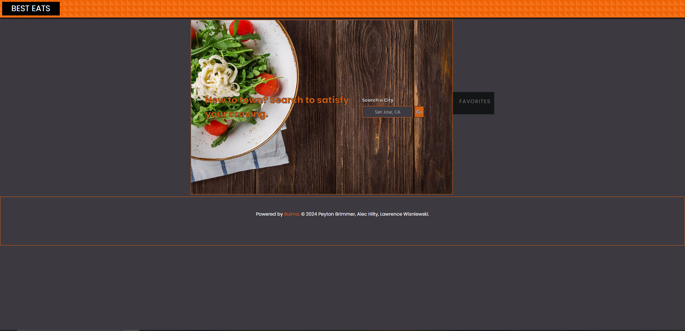

# Best Eats

## Description
Simple application that uses google places, geocoder, and places search API, to search for the top 5 rated restaurants in a city.

N/A

## Usage
Navigate to https://larwis95.github.io/best-eats/ in your browser. Type a city name in the US with "City Name, State Intials", hit the 'go' button. The page will be updates with 5 cards that show the rating, name and a photo of the 5 highest rated restaurants within 5 miles of that search location. Click on a card to see a dialog box with address, phone numbers, and website for that restaurant. It will also display the 5 most helpful reviews for that restaurant. Use the button in dialog to save it to the favorites list. Use the x or click on the background to leave the dialog box. Click on an item in your favorites list to bring that dialog up again. Use the provided X in the favorites list to delete it from favorites.

## Screen shot

## License

N/A